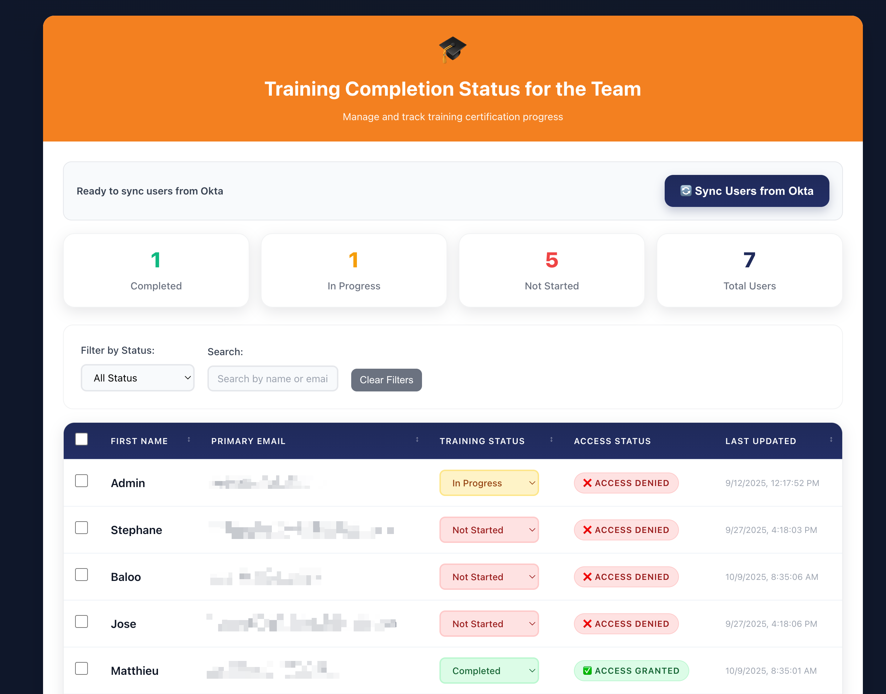
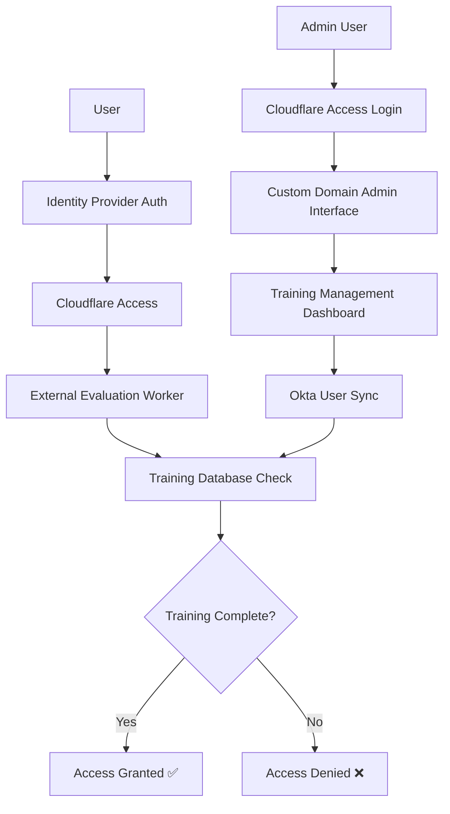
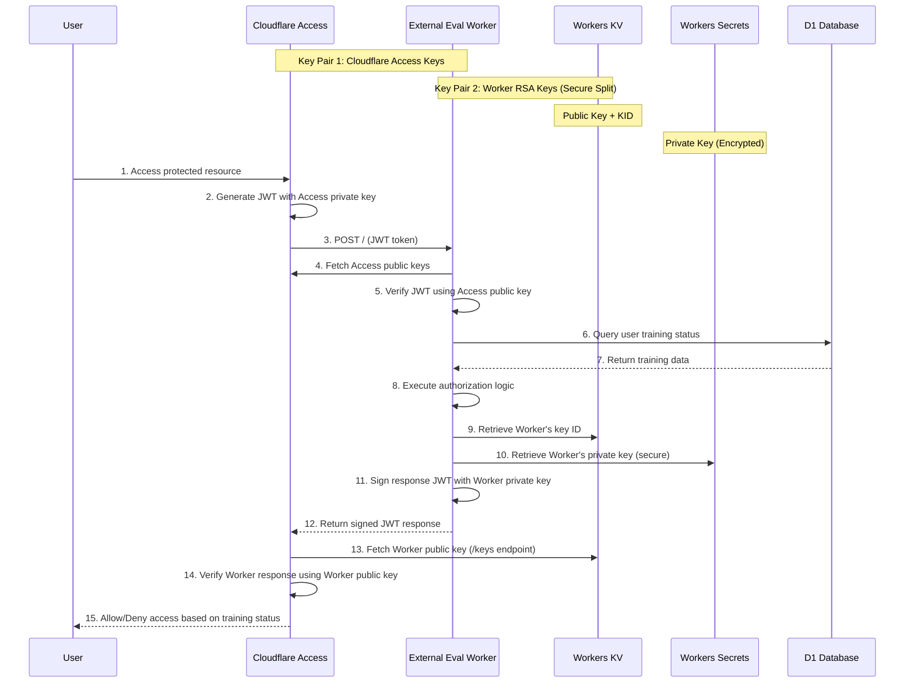

# Training Compliance Gateway for Cloudflare Zero Trust

A **production-ready Cloudflare Worker** that implements an **External Evaluation Rule** for Cloudflare Access, providing training-based access control to enhance your Zero Trust security posture. This worker maintains a database of user training completion status and blocks access to sensitive applications until users complete required security training.

[](https://deploy.workers.cloudflare.com/?url=https://github.com/macharpe/cloudflare-access-training-evaluator)




## 🎯 **Core Use Case: Training-Based Access Control**

### **The Security Challenge**

Traditional identity providers (Google, Okta, Azure AD) can authenticate users, but they can't enforce **business-specific security requirements** like mandatory training completion. This creates a security gap where authenticated users might access sensitive systems without proper security awareness.

### **The Solution**

This worker acts as a **security gateway** that:

1. **Intercepts** all access requests after identity provider authentication
2. **Validates** user training completion status against a centralized database
3. **Blocks** access to sensitive applications until training is completed
4. **Provides** a secure management interface protected by Cloudflare Access

### **Zero Trust Enhancement**

By integrating with Cloudflare Access External Evaluation, this worker adds a **critical security layer** that enforces:

- ✅ **Mandatory Security Training** before accessing sensitive applications
- ✅ **Real-time Compliance Verification** on every access request
- ✅ **Centralized Training Status Management** via secure admin interface
- ✅ **Complete Audit Trail** of access decisions for compliance reporting
- ✅ **Identity-Based Administration** with full SSO integration

---

## 🏗️ **Production Architecture**


```mermaid
graph TD
    A[User] --> B[Identity Provider Auth]
    B --> C[Cloudflare Access]
    C --> D[External Evaluation Worker]
    D --> E[Training Database Check]
    E --> F{Training Complete?}
    F -->|Yes| G[Access Granted ✅]
    F -->|No| H[Access Denied ❌]

    I[Admin User] --> J[Cloudflare Access Login]
    J --> K[Custom Domain Admin Interface]
    K --> L[Training Management Dashboard]
    L --> M[Okta User Sync]
    M --> E
```

### **Authentication Workflow with Dual Key Pairs**

This worker implements a sophisticated dual key pair authentication system for secure bidirectional JWT communication with Cloudflare Access:


```mermaid
sequenceDiagram
    participant User
    participant Access as Cloudflare Access
    participant Worker as External Eval Worker
    participant KV as Workers KV
    participant Secrets as Workers Secrets
    participant D1 as D1 Database

    Note over Access, Worker: Key Pair 1: Cloudflare Access Keys
    Note over Worker, KV: Key Pair 2: Worker RSA Keys (Secure Split)
    Note over KV: Public Key + KID
    Note over Secrets: Private Key (Encrypted)

    User->>Access: 1. Access protected resource
    Access->>Access: 2. Generate JWT with Access private key
    Access->>Worker: 3. POST / (JWT token)

    Worker->>Access: 4. Fetch Access public keys
    Worker->>Worker: 5. Verify JWT using Access public key

    Worker->>D1: 6. Query user training status
    D1-->>Worker: 7. Return training data

    Worker->>Worker: 8. Execute authorization logic
    Worker->>KV: 9. Retrieve Worker's key ID
    Worker->>Secrets: 10. Retrieve Worker's private key (secure)
    Worker->>Worker: 11. Sign response JWT with Worker private key

    Worker-->>Access: 12. Return signed JWT response
    Access->>KV: 13. Fetch Worker public key (/keys endpoint)
    Access->>Access: 14. Verify Worker response using Worker public key
    Access-->>User: 15. Allow/Deny access based on training status
```

#### **Key Management Strategy**

- **Cloudflare Access Keys**: Access signs outbound JWTs to Worker, Worker verifies using Access public keys
- **Worker RSA Keys**: Securely split between storage systems for enhanced security:
  - **Public Key + KID**: Stored in Workers KV for Access to verify signatures via `/keys` endpoint
  - **Private Key**: Stored encrypted in Workers Secrets, never exposed in KV or logs

### **Security Flow Summary**

1. **User Authentication**: User authenticates via identity provider (Google, Okta, etc.)
2. **Access Request**: User attempts to access a protected application
3. **External Evaluation**: Cloudflare Access calls this worker for additional validation
4. **Training Check**: Worker queries D1 database for user's training completion status
5. **Access Decision**: Worker returns signed JWT response (allow/deny) to Cloudflare Access
6. **Final Decision**: Cloudflare Access enforces the training-based access decision

### **Admin Management Flow**

1. **Admin Access**: Administrator visits custom domain (e.g., `training-status.company.com`)
2. **Access Protection**: Cloudflare Access authenticates the admin user
3. **Admin Interface**: Secure dashboard for managing training status and syncing users
4. **Okta Integration**: Real-time user synchronization from identity provider

---

## 🚀 **Key Features**

### **🎓 Enterprise Training Compliance**

- **Training Status Tracking**: Three-state model (`not started` → `started` → `completed`)
- **Email-Based Identification**: Uses primary email for user identification
- **Real-time Enforcement**: Blocks access instantly based on training status
- **Audit Trail**: Complete logging of all access decisions

### **🔐 Enterprise Security Framework**

- **Content Security Policy (CSP)**: Complete CSP implementation with nonce-based protection against XSS attacks
- **Security Headers**: Comprehensive security headers on all responses (X-Frame-Options, X-Content-Type-Options, etc.)
- **Cloudflare Access Authentication**: All admin endpoints protected by Zero Trust authentication
- **Custom Domain**: Professional branded URL for admin access
- **JWT Token Validation**: Cryptographic verification of all Access tokens
- **RSA Key Management**: Automatic key generation with secure split storage (public keys in KV, private keys in encrypted Workers Secrets)
- **Signed Responses**: All responses to Access are cryptographically signed
- **Single Sign-On Integration**: Seamless authentication through your identity provider
- **Defense in Depth**: Multiple security layers including CSP, CSRF protection, and clickjacking prevention

### **📊 Professional Management Interface**

- **Secure Admin Dashboard**: Protected by Cloudflare Access authentication
- **Custom Domain Access**: Professional URL (e.g., `training-status.company.com`)
- **Real-time User Overview**: View all users with training status and access permissions
- **One-Click Operations**: Sync users from Okta, update training status
- **Responsive Design**: Works on desktop and mobile devices
- **Dark / Light Mode**: Per-user theme toggle with `localStorage` persistence and `prefers-color-scheme` default across all pages
- **Kumo Design System**: UI rebuilt on Cloudflare's Kumo semantic token system — consistent surfaces, status colours, and typography matching the Cloudflare Workers design language

### **🔄 Enterprise Identity Integration**

- **Two-Way Okta Synchronization**: Bidirectional sync that adds, updates, and removes users
- **User Details**: Automatically sync first names and email addresses
- **Group Support**: Sync specific user groups for targeted training programs
- **Real-time Updates**: Keep user information synchronized with identity provider
- **Automatic Cleanup**: Removes users from database when deleted from Okta

---

## 🛡️ **Security Features**

### **Content Security Policy (CSP)**

The worker implements a comprehensive Content Security Policy to protect against XSS attacks and code injection:

- **Nonce-Based Protection**: Each request generates unique cryptographic nonces for inline scripts and styles
- **Strict Directives**: Production policy blocks all unauthorized content sources
- **Development Mode**: More permissive policy when `DEBUG=true` for easier development
- **Security Headers**: All responses include comprehensive security headers

### **Security Headers Included**

| Header                    | Value                                     | Purpose                        |
| ------------------------- | ----------------------------------------- | ------------------------------ |
| `Content-Security-Policy` | Nonce-based strict policy                 | XSS and injection protection   |
| `X-Content-Type-Options`  | `nosniff`                                 | Prevents MIME sniffing attacks |
| `X-Frame-Options`         | `DENY`                                    | Clickjacking protection        |
| `X-XSS-Protection`        | `1; mode=block`                           | Browser XSS filtering          |
| `Referrer-Policy`         | `strict-origin-when-cross-origin`         | Controls referrer information  |
| `Permissions-Policy`      | Restricts geolocation, microphone, camera | Limits dangerous APIs          |

### **Attack Vector Protection**

- ✅ **Cross-Site Scripting (XSS)**: CSP with nonces blocks unauthorized scripts
- ✅ **Clickjacking**: Frame protection prevents iframe embedding
- ✅ **Content Injection**: Strict CSP directives control all content sources
- ✅ **MIME Sniffing**: X-Content-Type-Options prevents content type confusion
- ✅ **CSRF**: Same-origin policy and CSP form-action restrictions
- ✅ **Mixed Content**: CSP blocks insecure content on HTTPS

**Security Grade: A+** - Meets enterprise security standards with defense-in-depth approach.

---

## 📋 **API Endpoints Reference**

### **Public Endpoints** (Used by Cloudflare Access)

| Endpoint | Method | Description                  | Usage                                                |
| -------- | ------ | ---------------------------- | ---------------------------------------------------- |
| `/`      | POST   | **Main evaluation endpoint** | Called by Cloudflare Access for every access request |
| `/keys`  | GET    | **JWKS public key endpoint** | Used by Access to verify worker response signatures  |

### **Protected Admin Endpoints** (Cloudflare Access Authentication)

| Endpoint                            | Method | Description                       | Purpose                                              |
| ----------------------------------- | ------ | --------------------------------- | ---------------------------------------------------- |
| `custom-domain/admin`               | GET    | **Training management dashboard** | Secure web interface for administrators              |
| `custom-domain/api/update-training` | POST   | **Update user training status**   | Change training completion status                    |
| `custom-domain/api/okta/sync`       | POST   | **Two-way sync users from Okta**  | Add, update, and remove users from identity provider |
| `custom-domain/api/okta/users`      | GET    | **List Okta users**               | View available users before syncing                  |
| `custom-domain/api/okta/groups`     | GET    | **List Okta groups**              | Find group IDs for targeted syncing                  |

---

## 🛠️ **Complete Deployment Guide**

### **Prerequisites**

- Cloudflare account with **Workers** and **Zero Trust Access** enabled
- Custom domain configured with **Cloudflare** (e.g., `company.com`)
- **Wrangler CLI** installed: `npm install -g wrangler`
- **Okta instance** (optional, for user synchronization)

### **Step 1: Project Setup**

```bash
# Clone the repository
git clone https://github.com/macharpe/cloudflare-access-training-evaluator.git
cd cloudflare-access-training-evaluator

# Install dependencies
npm install
```

### **Step 2: Infrastructure Setup**

```bash
# Create KV namespace for RSA keys
wrangler kv:namespace create "KEY_STORAGE"

# Create D1 database for training status
wrangler d1 create training-completion-status-db
```

### **Step 3: Configuration**

The `wrangler.jsonc` file contains all the configuration for your Worker including KV namespace, D1 database, and environment variables.

**When cloning this repository:**

- ✅ Update KV namespace ID with your own (see comments in wrangler.jsonc)
- ✅ Update D1 database ID with your own (see comments in wrangler.jsonc)
- ✅ Update domain variables with your own domains (see comments in wrangler.jsonc)
- ✅ Direct resource IDs for reliable deployments and GitHub integration
- ✅ Simplified deployment with `wrangler deploy`

### **Step 4: Security Configuration**

#### **Creating an Okta API Token**

1. **Login to Okta Admin Dashboard**: `https://your-okta-domain.okta.com/admin`
2. **Navigate to API Tokens**:
   - **Security** → **API** → **Tokens**
3. **Create Token**:
   - Click **"Create Token"**
   - **Name**: `Cloudflare Training Worker`
   - **Expires**: Set appropriate expiration (recommend 1 year)
   - Click **"Create Token"**
4. **Copy Token**: Save the token immediately (it won't be shown again)
5. **Required Permissions**: The token needs read access to:
   - Users (`okta.users.read`)
   - Groups (`okta.groups.read`)

#### **Configure Environment Variables and Secrets**

**Environment Variables** (in `wrangler.jsonc` vars section):

```json
"vars": {
  "OKTA_DOMAIN": "your-okta-domain.okta.com"
}
```

**Secrets**:

```bash
# Required: Worker's RSA private key for JWT signing (see Step 6A for initial setup)
wrangler secret put RSA_PRIVATE_KEY   # RSA private key in JWK format

# Required: Okta integration (if using)
wrangler secret put OKTA_API_TOKEN   # Your Okta API token from above

# Required: Access application audience (from Zero Trust Dashboard)
wrangler secret put ACCESS_APP_AUD   # Your Access application audience ID
```

### **Step 5: Configure Custom Domain**

#### **DNS Configuration:**

1. **Cloudflare Dashboard** → Your domain
2. **DNS** → **Records** → **Add record**
3. **Configure**:
   - **Type**: `CNAME`
   - **Name**: `training-status` (or your preferred subdomain)
   - **Target**: `your-custom-domain.com`
   - **Proxy status**: ✅ **Proxied**

#### **Worker Route:**

1. **Workers & Pages** → **your-worker** → **Settings** → **Triggers**
2. **Add Route**:
   - **Route**: `training-status.your-domain.com/*`
   - **Zone**: `your-domain.com`

### **Step 6: RSA Key Setup**

#### **Step 6A: Initial RSA Key Generation**

For new deployments, you'll need to generate RSA keys. The worker will generate keys automatically on first `/keys` endpoint call, but you need to manually configure the private key as a secret.

```bash
# 1. Deploy worker (without RSA_PRIVATE_KEY secret initially)
wrangler deploy

# 2. Generate keys by calling the /keys endpoint (this will show the private key in logs)
# You can use curl or visit in browser (protected by Access if configured)
curl https://training-status.your-domain.com/keys

# 3. Check the worker logs to get the private key JWK
wrangler tail --format pretty

# 4. Copy the private key JSON object from logs and set it as secret
wrangler secret put RSA_PRIVATE_KEY
# Paste the private key JWK JSON when prompted

# 5. Redeploy to use the secret
wrangler deploy
```

#### **Step 6B: Migrating Existing Keys (if upgrading)**

If you have an existing worker with keys stored in KV, extract the private key:

```bash
# 1. Get current private key from KV
wrangler kv:key get "external_auth_keys" --namespace-id YOUR_KV_NAMESPACE_ID

# 2. Copy the "private" key object from the JSON response
# 3. Set it as a Workers Secret
wrangler secret put RSA_PRIVATE_KEY
# Paste only the "private" key JSON object when prompted

# 4. Deploy the updated worker
wrangler deploy
```

### **Step 7: Deploy Worker**

```bash
# Deploy
wrangler deploy

# Initialize the database (requires Cloudflare Access authentication)
# Access the /init-db endpoint through your browser after authenticating via Access:
# https://training-status.your-domain.com/init-db
```

### **Step 8: Configure Cloudflare Access Application**

1. **Zero Trust Dashboard** → **Access** → **Applications**
2. **Add Application** → **Self-hosted**
3. **Configure Application**:
   - **Application name**: `Training Status Admin`
   - **Session Duration**: `24 hours`

4. **Public Hostnames** (Add four entries for simplified configuration):
   - **Entry 1**: Host: `training-status.your-domain.com`, Path: `/admin` (for app launcher tile)
   - **Entry 2**: Host: `training-status.your-domain.com`, Path: `/admin*` (covers /admin and admin interface)
   - **Entry 3**: Host: `training-status.your-domain.com`, Path: `/api/*` (covers all API endpoints)
   - **Entry 4**: Host: `training-status.your-domain.com`, Path: `/init-db` (for database initialization)

5. **Access Policy**:
   - **Policy name**: `Training Administrators`
   - **Action**: `Allow`
   - **Configure rules** (examples):
     - `Email: admin@your-domain.com`
     - `Emails ending in: @your-domain.com`
     - `Groups: TrainingAdmins`

6. **Get Application Audience ID**:
   - After creating, note the **Application Audience ID**
   - Set it as secret: `wrangler secret put ACCESS_APP_AUD`

### **Step 9: Configure External Evaluation**

1. **Zero Trust Dashboard** → **Access** → **Applications**
2. **Select your protected application** (the one requiring training)
3. **Edit Policy** → **Add External Evaluation Rule**:
   - **Evaluate URL**: `https://training-status.your-domain.com` _(remove trailing "/" if present)_
   - **Keys URL**: `https://training-status.your-domain.com/keys` _(remove trailing "/" if present)_

#### **Important: URL Format**

- ✅ **Correct**: `https://training-status.your-domain.com`
- ❌ **Incorrect**: `https://training-status.your-domain.com/`
- **Note**: Cloudflare Access External Evaluation requires URLs without trailing slashes to function properly

---

## 👥 **Administration Guide**

### **Accessing the Admin Interface**

```bash
https://training-status.your-domain.com/admin
```

- **Authentication**: Cloudflare Access (your corporate SSO)
- **Interface**: Professional dashboard with user management
- **Security**: Protected by Zero Trust policies

### **Initial Setup**

1. **Visit the admin interface** using your custom domain
2. **Authenticate** via Cloudflare Access
3. **Sync users from Okta** using the sync button
4. **Set initial training status** for users as needed

### **User Management**

- **View Users**: See all synced users with training status
- **Update Status**: Use dropdown menus to change training completion
- **Two-Way Sync**: One-click bidirectional synchronization from Okta (adds, updates, and removes users)
- **Monitor Access**: View which users have access based on training
- **Automatic Cleanup**: Users removed from Okta are automatically removed from the database

### **API Management**

All API endpoints are protected by Cloudflare Access:

```bash
# Sync users (authenticated via Access)
curl -X POST https://training-status.your-domain.com/api/okta/sync

# Update training status (authenticated via Access)
curl -X POST https://training-status.your-domain.com/api/update-training \
  -H "Content-Type: application/json" \
  -d '{"email": "user@domain.com", "status": "completed"}'
```

---

## 🔧 **Customization**

### **Training Logic Customization**

Edit `src/auth/evaluation.js` to modify access decision logic:

```javascript
export async function externalEvaluation(claims, env) {
  const email = claims.identity.email

  // Get user training status from database
  const user = await env.DB.prepare(
    'SELECT training_status FROM users WHERE primary_email = ?',
  )
    .bind(email)
    .first()

  if (!user) {
    console.log(`User ${email} not found in training database - denying access`)
    return false
  }

  // Only allow access if training is completed
  const hasCompleted = user.training_status === 'completed'
  console.log(
    `User ${email} training status: ${user.training_status} - ${hasCompleted ? 'ALLOW' : 'DENY'}`,
  )

  return hasCompleted
}
```

### **Advanced Customization Options**

- **Time-based validation**: Check if training is still valid (not expired)
- **Multi-level training**: Different requirements for different applications
- **Geographic restrictions**: Combine with location-based access controls
- **Risk scoring**: Integrate with security tools for additional context
- **Department-based rules**: Different training requirements by department

---

## 📊 **Monitoring and Operations**

### **Live Monitoring**

```bash
# Watch real-time logs
wrangler tail --format pretty

# Filter for access decisions
wrangler tail --format pretty | grep -E "(ALLOW|DENY)"
```

### **Database Queries**

```bash
# View all users and training status
wrangler d1 execute training-completion-status-db --remote \
  --command="SELECT first_name, primary_email, training_status, updated_at FROM users ORDER BY updated_at DESC"

# Training completion statistics
wrangler d1 execute training-completion-status-db --remote \
  --command="SELECT training_status, COUNT(*) as count FROM users GROUP BY training_status"

# Recent training updates
wrangler d1 execute training-completion-status-db --remote \
  --command="SELECT first_name, primary_email, training_status, updated_at FROM users WHERE updated_at > datetime('now', '-7 days') ORDER BY updated_at DESC"
```

### **Access Logs**

- **Zero Trust Dashboard** → **Logs** → **Access**
- Monitor admin interface access attempts
- Track training status changes and user activity

---

## 🏢 **Production Deployment**

### **Security Checklist**

- [ ] Verify RSA private key is stored only in Workers Secrets, not in KV
- [ ] Configure appropriate Cloudflare Access policies for admin interface
- [ ] Set up regular rotation of RSA keys, Okta API tokens and secrets
- [ ] Disable debug logging (`DEBUG: false` in wrangler.jsonc)
- [ ] Review and configure geographic access restrictions if needed
- [ ] Clear any temporary private key data from logs after initial setup
- [ ] Verify CSP headers are present on all responses
- [ ] Test security headers using security scanning tools
- [ ] Review Content Security Policy configuration for your environment

### **Monitoring & Maintenance**

- [ ] Set up monitoring for Worker execution and D1 database performance
- [ ] Configure log retention and audit trail storage
- [ ] Plan for regular D1 database backups
- [ ] Document incident response procedures for access failures

### **Scalability Notes**

- D1 database handles thousands of users with automatic scaling
- Global edge deployment provides sub-millisecond response times
- RSA keys and configuration stored redundantly across regions

---

## 📚 **Resources & Support**

### **Documentation**

- [Cloudflare Access External Evaluation](https://developers.cloudflare.com/cloudflare-one/policies/access/external-evaluation/)
- [Cloudflare Workers Documentation](https://developers.cloudflare.com/workers/)
- [Cloudflare D1 Database](https://developers.cloudflare.com/d1/)
- [Cloudflare Zero Trust](https://developers.cloudflare.com/cloudflare-one/)

### **GitHub Repository**

- **Repository**: [https://github.com/macharpe/cloudflare-access-training-evaluator](https://github.com/macharpe/cloudflare-access-training-evaluator)
- **Issues & Support**: [GitHub Issues](https://github.com/macharpe/cloudflare-access-training-evaluator/issues)
- **Cloudflare Integration**: Repository is linked to the Cloudflare Worker for automatic deployments

### **Community & Support**

- [Cloudflare Community Forum](https://community.cloudflare.com/)
- [Cloudflare Discord](https://discord.gg/cloudflaredev)

---

## 🚀 **Getting Started**

### **Quick Start for Development**

```bash
# Clone and setup
git clone https://github.com/macharpe/cloudflare-access-training-evaluator.git
cd cloudflare-access-training-evaluator
npm install

# Configure infrastructure
wrangler kv:namespace create "external-auth-keys"
wrangler d1 create training-completion-status-db

# Update wrangler.jsonc with your actual IDs from above commands
# (See comments in wrangler.jsonc for what needs to be updated)

# Deploy and test
wrangler deploy
```

### **Production Deployment Checklist**

- [ ] Custom domain configured and DNS updated
- [ ] Worker route configured for custom domain
- [ ] Cloudflare Access application created and configured
- [ ] Access policies configured for administrators
- [ ] Okta integration configured (if using)
- [ ] External evaluation rule added to protected applications
- [ ] Initial users synced and training status set
- [ ] Monitoring and alerting configured

---

## 📄 **License**

This project is licensed under the MIT License - see the [LICENSE](LICENSE) file for details.

---

**🎉 Ready to deploy enterprise-grade training-based access control?** This production-ready solution integrates seamlessly with your existing Cloudflare Zero Trust infrastructure to enforce security training compliance across your organization!

**🔗 Custom Domain Access**: `https://training-status.your-domain.com/admin`
**🔐 Secure by Design**: Protected by Cloudflare Access with full SSO integration
**🚀 Enterprise Ready**: Scalable, auditable, and compliant with security best practices
