# Training Compliance Gateway for Cloudflare Zero Trust

A **production-ready Cloudflare Worker** that implements an **External Evaluation Rule** for Cloudflare Access, providing training-based access control to enhance your Zero Trust security posture. This worker maintains a database of user training completion status and blocks access to sensitive applications until users complete required security training.


## 🎯 **Core Use Case: Training-Based Access Control**

### **The Security Challenge**
Traditional identity providers (Google, Okta, Azure AD) can authenticate users, but they can't enforce **business-specific security requirements** like mandatory training completion. This creates a security gap where authenticated users might access sensitive systems without proper security awareness.

### **The Solution**
This worker acts as a **security gateway** that:
1. **Intercepts** all access requests after identity provider authentication
2. **Validates** user training completion status against a centralized database
3. **Blocks** access to sensitive applications until training is completed
4. **Provides** a secure management interface protected by Cloudflare Access

### **Zero Trust Enhancement**
By integrating with Cloudflare Access External Evaluation, this worker adds a **critical security layer** that enforces:
- ✅ **Mandatory Security Training** before accessing sensitive applications
- ✅ **Real-time Compliance Verification** on every access request
- ✅ **Centralized Training Status Management** via secure admin interface
- ✅ **Complete Audit Trail** of access decisions for compliance reporting
- ✅ **Identity-Based Administration** with full SSO integration

---

## 🏗️ **Production Architecture**

```mermaid
graph TD
    A[User] --> B[Identity Provider Auth]
    B --> C[Cloudflare Access]
    C --> D[External Evaluation Worker]
    D --> E[Training Database Check]
    E --> F{Training Complete?}
    F -->|Yes| G[Access Granted ✅]
    F -->|No| H[Access Denied ❌]
    
    I[Admin User] --> J[Cloudflare Access Login]
    J --> K[Custom Domain Admin Interface]
    K --> L[Training Management Dashboard]
    L --> M[Okta User Sync]
    M --> E
```



### **Security Flow**
1. **User Authentication**: User authenticates via identity provider (Google, Okta, etc.)
2. **Access Request**: User attempts to access a protected application
3. **External Evaluation**: Cloudflare Access calls this worker for additional validation
4. **Training Check**: Worker queries D1 database for user's training completion status
5. **Access Decision**: Worker returns signed JWT response (allow/deny) to Cloudflare Access
6. **Final Decision**: Cloudflare Access enforces the training-based access decision

### **Admin Management Flow**
1. **Admin Access**: Administrator visits custom domain (e.g., `training-status.company.com`)
2. **Access Protection**: Cloudflare Access authenticates the admin user
3. **Admin Interface**: Secure dashboard for managing training status and syncing users
4. **Okta Integration**: Real-time user synchronization from identity provider

---

## 🚀 **Key Features**

### **🎓 Enterprise Training Compliance**
- **Training Status Tracking**: Three-state model (`not started` → `started` → `completed`)
- **Email-Based Identification**: Uses primary email for user identification
- **Real-time Enforcement**: Blocks access instantly based on training status
- **Audit Trail**: Complete logging of all access decisions

### **🔐 Production Security**
- **Cloudflare Access Protected**: Admin interface secured with enterprise SSO
- **Custom Domain**: Professional branded URL for admin access
- **JWT Token Validation**: Cryptographic verification of all Access tokens
- **RSA Key Management**: Automatic key generation and secure storage
- **Signed Responses**: All responses to Access are cryptographically signed

### **📊 Professional Management Interface**
- **Secure Admin Dashboard**: Protected by Cloudflare Access authentication
- **Custom Domain Access**: Professional URL (e.g., `training-status.company.com`)
- **Real-time User Overview**: View all users with training status and access permissions
- **One-Click Operations**: Sync users from Okta, update training status
- **Responsive Design**: Works on desktop and mobile devices

### **🔄 Enterprise Identity Integration**
- **Okta Synchronization**: Pull users directly from your Okta instance
- **User Details**: Automatically sync first names and email addresses
- **Group Support**: Sync specific user groups for targeted training programs
- **Real-time Updates**: Keep user information synchronized with identity provider

---

## 📋 **API Endpoints Reference**

### **Public Endpoints** (Used by Cloudflare Access)
| Endpoint | Method | Description | Usage |
|----------|--------|-------------|-------|
| `/` | POST | **Main evaluation endpoint** | Called by Cloudflare Access for every access request |
| `/keys` | GET | **JWKS public key endpoint** | Used by Access to verify worker response signatures |

### **Protected Admin Endpoints** (Cloudflare Access Authentication)
| Endpoint | Method | Description | Purpose |
|----------|--------|-------------|---------|
| `custom-domain/admin` | GET | **Training management dashboard** | Secure web interface for administrators |
| `custom-domain/api/update-training` | POST | **Update user training status** | Change training completion status |
| `custom-domain/api/okta/sync` | POST | **Sync users from Okta** | Import/update users from identity provider |
| `custom-domain/api/okta/users` | GET | **List Okta users** | View available users before syncing |
| `custom-domain/api/okta/groups` | GET | **List Okta groups** | Find group IDs for targeted syncing |

---

## 🛠️ **Complete Deployment Guide**

### **Prerequisites**
- Cloudflare account with **Workers** and **Zero Trust Access** enabled
- Custom domain configured with **Cloudflare** (e.g., `company.com`)
- **Wrangler CLI** installed: `npm install -g wrangler`
- **Okta instance** (optional, for user synchronization)

### **Step 1: Project Setup**
```bash
# Clone the repository
git clone https://github.com/macharpe/cloudflare-access-sso-worker.git
cd cloudflare-access-sso-worker

# Install dependencies
npm install
```

### **Step 2: Infrastructure Setup**
```bash
# Create KV namespace for RSA keys
wrangler kv:namespace create "KV"

# Create D1 database for training status
wrangler d1 create training-completion-status-db
```

### **Step 3: Configuration**

The `wrangler.jsonc` file contains all the configuration for your Worker including KV namespace, D1 database, and environment variables.

**When cloning this repository:**
- ✅ Update KV namespace ID with your own (see comments in wrangler.jsonc)
- ✅ Update D1 database ID with your own (see comments in wrangler.jsonc)  
- ✅ Update domain variables with your own domains (see comments in wrangler.jsonc)
- ✅ Direct resource IDs for reliable deployments and GitHub integration
- ✅ Simplified deployment with `wrangler deploy`

### **Step 4: Security Configuration**

#### **Creating an Okta API Token**
1. **Login to Okta Admin Dashboard**: `https://your-okta-domain.okta.com/admin`
2. **Navigate to API Tokens**:
   - **Security** → **API** → **Tokens**
3. **Create Token**:
   - Click **"Create Token"**
   - **Name**: `Cloudflare Training Worker`
   - **Expires**: Set appropriate expiration (recommend 1 year)
   - Click **"Create Token"**
4. **Copy Token**: Save the token immediately (it won't be shown again)
5. **Required Permissions**: The token needs read access to:
   - Users (`okta.users.read`)
   - Groups (`okta.groups.read`)

#### **Configure Secrets**
```bash
# Required: Okta integration (if using)
wrangler secret put OKTA_DOMAIN      # e.g., "dev-12345.okta.com"
wrangler secret put OKTA_API_TOKEN   # Your Okta API token from above

# Required: Access application audience (from Zero Trust Dashboard)
wrangler secret put ACCESS_APP_AUD   # Your Access application audience ID
```

### **Step 5: Deploy Worker**
```bash
# Deploy
wrangler deploy

# Initialize the database
curl "https://your-worker.workers.dev/init-db"
```

### **Step 6: Configure Custom Domain**

#### **DNS Configuration:**
1. **Cloudflare Dashboard** → Your domain
2. **DNS** → **Records** → **Add record**
3. **Configure**:
   - **Type**: `CNAME`
   - **Name**: `training-status` (or your preferred subdomain)
   - **Target**: `your-worker.workers.dev`
   - **Proxy status**: ✅ **Proxied**

#### **Worker Route:**
1. **Workers & Pages** → **your-worker** → **Settings** → **Triggers**
2. **Add Route**:
   - **Route**: `training-status.your-company.com/*`
   - **Zone**: `your-company.com`

### **Step 7: Configure Cloudflare Access Application**

1. **Zero Trust Dashboard** → **Access** → **Applications**
2. **Add Application** → **Self-hosted**
3. **Configure Application**:
   - **Application name**: `Training Status Admin`
   - **Session Duration**: `24 hours`

4. **Public Hostnames** (Add two entries):
   - **Entry 1**: Host: `training-status.your-company.com`, Path: `/admin*`
   - **Entry 2**: Host: `training-status.your-company.com`, Path: `/api/*`

5. **Access Policy**:
   - **Policy name**: `Training Administrators`
   - **Action**: `Allow`
   - **Configure rules** (examples):
     - `Email: admin@your-company.com`
     - `Emails ending in: @your-company.com`
     - `Groups: TrainingAdmins`

6. **Get Application Audience ID**:
   - After creating, note the **Application Audience ID**
   - Set it as secret: `wrangler secret put ACCESS_APP_AUD`

### **Step 8: Configure External Evaluation**

1. **Zero Trust Dashboard** → **Access** → **Applications**
2. **Select your protected application** (the one requiring training)
3. **Edit Policy** → **Add External Evaluation Rule**:
   - **Evaluate URL**: `https://your-worker.workers.dev` *(remove trailing "/" if present)*
   - **Keys URL**: `https://your-worker.workers.dev/keys` *(remove trailing "/" if present)*

#### **Important: URL Format**
- ✅ **Correct**: `https://your-worker.workers.dev`
- ❌ **Incorrect**: `https://your-worker.workers.dev/`
- **Note**: Cloudflare Access External Evaluation requires URLs without trailing slashes to function properly

---

## 👥 **Administration Guide**

### **Accessing the Admin Interface**
```
https://training-status.your-company.com/admin
```
- **Authentication**: Cloudflare Access (your corporate SSO)
- **Interface**: Professional dashboard with user management
- **Security**: Protected by Zero Trust policies

### **Initial Setup**
1. **Visit the admin interface** using your custom domain
2. **Authenticate** via Cloudflare Access
3. **Sync users from Okta** using the sync button
4. **Set initial training status** for users as needed

### **User Management**
- **View Users**: See all synced users with training status
- **Update Status**: Use dropdown menus to change training completion
- **Sync Users**: One-click synchronization from Okta
- **Monitor Access**: View which users have access based on training

### **API Management**
All API endpoints are protected by Cloudflare Access:
```bash
# Sync users (authenticated via Access)
curl -X POST https://training-status.your-company.com/api/okta/sync

# Update training status (authenticated via Access)  
curl -X POST https://training-status.your-company.com/api/update-training \
  -H "Content-Type: application/json" \
  -d '{"email": "user@company.com", "status": "completed"}'
```

---

## 🔧 **Customization**

### **Training Logic Customization**
Edit `src/auth/evaluation.js` to modify access decision logic:

```javascript
export async function externalEvaluation(claims, env) {
  const email = claims.identity.email
  
  // Get user training status from database
  const user = await env.DB.prepare(
    'SELECT training_status FROM users WHERE primary_email = ?'
  ).bind(email).first()
  
  if (!user) {
    console.log(`User ${email} not found in training database - denying access`)
    return false
  }
  
  // Only allow access if training is completed
  const hasCompleted = user.training_status === 'completed'
  console.log(`User ${email} training status: ${user.training_status} - ${hasCompleted ? 'ALLOW' : 'DENY'}`)
  
  return hasCompleted
}
```

### **Advanced Customization Options**
- **Time-based validation**: Check if training is still valid (not expired)
- **Multi-level training**: Different requirements for different applications
- **Geographic restrictions**: Combine with location-based access controls
- **Risk scoring**: Integrate with security tools for additional context
- **Department-based rules**: Different training requirements by department

---

## 📊 **Monitoring and Operations**

### **Live Monitoring**
```bash
# Watch real-time logs
wrangler tail --format pretty

# Filter for access decisions
wrangler tail --format pretty | grep -E "(ALLOW|DENY)"
```

### **Database Queries**
```bash
# View all users and training status
wrangler d1 execute training-completion-status-db --remote \
  --command="SELECT first_name, primary_email, training_status, updated_at FROM users ORDER BY updated_at DESC"

# Training completion statistics
wrangler d1 execute training-completion-status-db --remote \
  --command="SELECT training_status, COUNT(*) as count FROM users GROUP BY training_status"

# Recent training updates
wrangler d1 execute training-completion-status-db --remote \
  --command="SELECT first_name, primary_email, training_status, updated_at FROM users WHERE updated_at > datetime('now', '-7 days') ORDER BY updated_at DESC"
```

### **Access Logs**
- **Zero Trust Dashboard** → **Logs** → **Access**
- Monitor admin interface access attempts
- Track training status changes and user activity

---

## 🏢 **Production Deployment**

### **Security Checklist**
- [ ] Configure appropriate Cloudflare Access policies for admin interface
- [ ] Set up regular rotation of Okta API tokens and secrets
- [ ] Disable debug logging (`DEBUG: false` in wrangler.jsonc)
- [ ] Review and configure geographic access restrictions if needed

### **Monitoring & Maintenance**
- [ ] Set up monitoring for Worker execution and D1 database performance
- [ ] Configure log retention and audit trail storage
- [ ] Plan for regular D1 database backups
- [ ] Document incident response procedures for access failures

### **Scalability Notes**
- D1 database handles thousands of users with automatic scaling
- Global edge deployment provides sub-millisecond response times
- RSA keys and configuration stored redundantly across regions

---

## 📚 **Resources & Support**

### **Documentation**
- [Cloudflare Access External Evaluation](https://developers.cloudflare.com/cloudflare-one/policies/access/external-evaluation/)
- [Cloudflare Workers Documentation](https://developers.cloudflare.com/workers/)
- [Cloudflare D1 Database](https://developers.cloudflare.com/d1/)
- [Cloudflare Zero Trust](https://developers.cloudflare.com/cloudflare-one/)

### **GitHub Repository**
- **Repository**: [https://github.com/macharpe/cloudflare-access-sso-worker](https://github.com/macharpe/cloudflare-access-sso-worker)
- **Issues & Support**: [GitHub Issues](https://github.com/macharpe/cloudflare-access-sso-worker/issues)
- **Cloudflare Integration**: Repository is linked to the Cloudflare Worker for automatic deployments

### **Community & Support**
- [Cloudflare Community Forum](https://community.cloudflare.com/)
- [Cloudflare Discord](https://discord.gg/cloudflaredev)

---

## 🚀 **Getting Started**

### **Quick Start for Development**
```bash
# Clone and setup
git clone https://github.com/macharpe/cloudflare-access-sso-worker.git
cd cloudflare-access-sso-worker
npm install

# Configure infrastructure
wrangler kv:namespace create "KV"
wrangler d1 create training-completion-status-db

# Update wrangler.jsonc with your actual IDs from above commands
# (See comments in wrangler.jsonc for what needs to be updated)

# Deploy and test
wrangler deploy
```

### **Production Deployment Checklist**
- [ ] Custom domain configured and DNS updated
- [ ] Worker route configured for custom domain
- [ ] Cloudflare Access application created and configured
- [ ] Access policies configured for administrators
- [ ] Okta integration configured (if using)
- [ ] External evaluation rule added to protected applications
- [ ] Initial users synced and training status set
- [ ] Monitoring and alerting configured

---


## 📄 **License**

This project is licensed under the MIT License - see the [LICENSE](LICENSE) file for details.

---

**🎉 Ready to deploy enterprise-grade training-based access control?** This production-ready solution integrates seamlessly with your existing Cloudflare Zero Trust infrastructure to enforce security training compliance across your organization!

**🔗 Custom Domain Access**: `https://training-status.your-company.com/admin`
**🔐 Secure by Design**: Protected by Cloudflare Access with full SSO integration
**🚀 Enterprise Ready**: Scalable, auditable, and compliant with security best practices